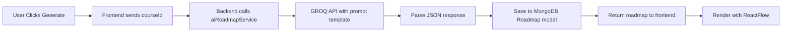

<div align="center">

# 🚀 PathPilot

### AI-Powered Academic Excellence Platform

*Intelligent course roadmaps • Personalized learning resources • Habit tracking • Burnout detection*

[](https://nextjs.org/)
[](https://react.dev/)
[](https://www.typescriptlang.org/)
[](https://tailwindcss.com/)
[](https://www.mongodb.com/)
[](https://www.python.org/)

[Features](#-features) • [Demo](#-demo) • [Installation](#-installation) • [Tech Stack](#-tech-stack) • [API](#-api-documentation)

---

</div>

## 🎯 Overview

PathPilot is an intelligent academic companion that combines **AI-powered course planning**, **machine learning-based resource recommendations**, and **behavioral analytics** to help students achieve academic excellence. With features like automatic roadmap generation, burnout detection, and personalized learning paths, PathPilot transforms the way students learn.

### 🌟 What Makes PathPilot Special?

- **🤖 AI-Driven Roadmaps**: Generate complete course learning paths using GROQ LLM
- **🎓 Smart Resource Discovery**: ML-ranked videos, articles, and documentation from YouTube & SERP APIs
- **📊 Behavioral Analytics**: Track habits, detect burnout patterns, and get personalized insights
- **📈 Weekly Progress Tracking**: Auto-resetting weekly goals with activity logging and history
- **🔍 Integrated Search**: Multi-source search directly in courses page for quick resource discovery
- **🏆 Gamification**: Streak tracking, badge system, and achievement milestones
- **🌓 Beautiful UI**: Professional zinc/gray theme with seamless dark mode and smooth animations


---

## 📸 Demo

### 🎨 Stunning User Interface
<div align="center">
  
  <p><em>Modern dashboard with real-time analytics and AI insights</em></p>
</div>

### 🗺️ AI-Generated Course Roadmaps
<div align="center">
  
  <p><em>Interactive visual roadmap with resource recommendations</em></p>
</div>

---


## ✨ Features

### 🤖 AI-Powered Learning

#### **Intelligent Roadmap Generation**
- **GROQ LLM Integration**: Automatically generate comprehensive learning roadmaps for any course
- **Step-by-Step Breakdown**: Topics split into manageable milestones with estimated hours
- **Visual Flow Diagrams**: Interactive roadmap visualization using ReactFlow
- **Smart Resource Fetching**: Auto-populate each step with curated learning materials

#### **ML-Based Resource Ranking**
- **Trained ML Model**: Scikit-learn model ranks resources by relevance and quality
- **Multi-Source Aggregation**:
  - 📹 **YouTube Videos**: Duration, view count, and educational value filtering
  - 📄 **Articles**: SERP API integration for latest educational content
  - 📚 **Documentation**: Curated trusted sources (MDN, W3Schools, official docs)
- **Smart Search**: Natural language queries converted to optimized search terms

#### **Behavioral Analytics & Burnout Detection**
- **Pattern Recognition**: Analyzes sleep, stress, mood, and study patterns
- **Early Warning System**: Detects burnout risk with AI-powered recommendations
- **Personalized Insights**: Weekly summaries with actionable advice
- **Trend Visualization**: Beautiful charts tracking your progress over time

### 🎨 Modern UI/UX
- **Zinc/Gray Theme**: Professional, easy-on-the-eyes color scheme
- **Dark Mode**: Seamless light/dark theme toggle with system preference detection
- **Smooth Animations**: Carefully timed transitions (0.6-0.9s) using Framer Motion
- **Skeleton Loaders**: Enhanced UX with loading states
- **Responsive Design**: Optimized for all screen sizes
- **Interactive Components**: Built with shadcn/ui for consistency

### 📚 Course Management
- **Dynamic Course Dashboard**: Real-time progress tracking with circular progress indicators
- **AI Learning Insights**: Smart recommendations for next focus areas
- **Category Organization**: Academic, Skill-based, or Hobby courses
- **Weekly Progress System**: 
  - Auto-resetting weekly goals (7-day cycle)
  - Track hours spent and tasks completed
  - View weekly progress percentage (hours/target × 100%)
  - Activity logging with notes and timestamps
- **Activity History**: View recent 10 activities with hours, tasks, and notes
- **Course Details Modal**: 
  - Weekly progress card with current stats
  - Overall progress tracking
  - Activity logging form (hours, tasks, notes)
  - Stats grid showing total activities and tasks completed
- **Interactive Roadmaps**: Click-to-explore learning paths with resource panels
- **Progress Persistence**: MongoDB-backed course state tracking
- **Integrated Search**: Search for resources directly from courses page

### 📅 Advanced Habit Tracking
- **Comprehensive Daily Logs**:
  - 😴 Sleep hours with quality tracking
  - 📖 Study time across multiple courses
  - 🎮 Entertainment balance monitoring
  - 💪 Exercise and physical activity
  - 🍎 Food quality rating (1-10 scale)
  - 😊 Mood tracking with historical trends
  - 😰 Stress level monitoring
- **Visual Calendar Heatmap**: React Calendar with activity indicators
- **Streak System**: Motivation through consecutive day tracking
- **Recent History View**: Tabbed interface for quick insights

### 🏆 Gamification & Achievements
- **Badge System**: Earn achievements for milestones
  - 🔥 Streak Master (7, 30, 100 days)
  - 📚 Course Completion badges
  - 🎯 Goal Achievement rewards
  - ⭐ Consistency Champion
- **Leaderboard Ready**: Track personal bests and records
- **Visual Rewards**: Gradient-styled badge cards with rarity levels

### 📊 Analytics Dashboard
- **Weekly Performance Summary**: Aggregated metrics with trend indicators
- **Burnout Detection**: AI analyzes patterns to prevent overwork
- **Visual Data**: Recharts integration for beautiful graphs
- **Comparison Views**: Week-over-week progress tracking
- **Export Ready**: Generate reports from analytics data

### 🔍 Smart Search
- **Course-Integrated Search**: Search panel available directly in courses page
- **Multi-Source Search**: Query across web, learning platforms, and news
- **Real-time Results**: Fast SERP API integration
- **Context-Aware**: Search within specific course contexts
- **Resource Filtering**: Type-based filtering (videos, articles, docs)
- **Quick Access**: No need to navigate away from course management

### 🔐 Security & Authentication
- **JWT-Based Auth**: Secure token-based authentication
- **Password Encryption**: Bcrypt hashing for user credentials
- **Protected Routes**: Middleware-based route protection
- **Persistent Sessions**: Secure localStorage token management
- **API Key Security**: Environment-based secret management
- **Auto-Dismiss Alerts**: User-friendly notifications with automatic timeout

---

## 🛠️ Tech Stack

### Frontend Architecture
```typescript
Framework:     Next.js 16.1.1 (App Router with Turbopack)
UI Library:    React 19.2.3 with TypeScript 5.x
Styling:       Tailwind CSS 4.0 + shadcn/ui components
State:         React Hooks + Context API
Animations:    Framer Motion 12.24.10
Visualization: ReactFlow 11.11.4 + Recharts 3.6.0
Calendar:      React Calendar 6.0.0
Icons:         React Icons 5.5.0 + Lucide React
Notifications: React Hot Toast 2.6.0
Theme:         next-themes 0.4.6 (dark mode support)
```

### Backend Architecture
```javascript
Runtime:       Node.js with Express.js 5.2.1
Database:      MongoDB 9.1.1 with Mongoose ODM
Authentication: JWT (jsonwebtoken 9.0.3)
Security:      bcryptjs 3.0.3
HTTP Client:   Axios 1.13.2
CORS:          Enabled with cors 2.8.5
Environment:   dotenv 17.2.3
Dev Tools:     Nodemon 3.1.11
```

### AI & Machine Learning
```python
Framework:     Python 3.8+ with FastAPI + Uvicorn
LLM Provider:  GROQ API (AI roadmap generation)
ML Library:    Scikit-learn (resource ranking model)
Training Data: CSV-based behavioral datasets
Model Format:  Pickle serialization
```

### External APIs
- **🎥 YouTube Data API v3**: Video resource discovery with statistics
- **🔍 SERP API**: Web search integration for articles and documentation
- **🤖 GROQ AI**: Large language model for roadmap generation
- **📊 Google Generative AI**: Backup AI service for insights

---

## 📁 Project Architecture

```
PathPilot/
├── 📱 client/                        # Next.js Frontend (TypeScript)
│   ├── src/
│   │   ├── app/                      # App Router Pages
│   │   │   ├── page.tsx              # AI-focused landing page with hero section
│   │   │   ├── layout.tsx            # Root layout with theme provider
│   │   │   ├── globals.css           # Global styles + Tailwind
│   │   │   ├── dashboard/            # Main dashboard
│   │   │   ├── courses/              # Course management UI
│   │   │   ├── roadmap/[courseId]/   # Dynamic roadmap viewer
│   │   │   ├── habits/               # Habit tracking interface
│   │   │   ├── calendar/             # Activity calendar heatmap
│   │   │   ├── analytics/            # Analytics & burnout detection
│   │   │   ├── badges/               # Achievement badges
│   │   │   ├── login/ & register/    # Authentication pages
│   │   │   └── home/                 # Authenticated home
│   │   ├── components/               # Reusable React Components
│   │   │   ├── Navbar.tsx            # Navigation with theme toggle
│   │   │   ├── Protected.tsx         # Auth guard component
│   │   │   ├── RoadmapFlow.tsx       # ReactFlow visualization
│   │   │   ├── SearchPanel.tsx       # Search interface
│   │   │   ├── ThemeProvider.tsx     # Dark mode context
│   │   │   ├── ToastProvider.tsx     # Notification provider
│   │   │   └── ui/                   # shadcn components (14+)
│   │   └── lib/
│   │       ├── api.ts                # API client with type-safe functions
│   │       └── utils.ts              # Utility functions (cn, etc.)
│   └── package.json                  # Frontend dependencies
│
├── 🔧 server/                        # Express.js Backend (JavaScript)
│   ├── index.js                      # Server entry point + middleware
│   ├── controllers/
│   │   └── userController.js         # User authentication logic
│   ├── middleware/
│   │   └── auth.js                   # JWT verification middleware
│   ├── models/                       # Mongoose Schemas
│   │   ├── User.js                   # User accounts
│   │   ├── Course.js                 # Course data
│   │   ├── Roadmap.js                # AI-generated roadmaps
│   │   ├── Resource.js               # Learning resources
│   │   ├── DailyLogs.js              # Habit tracking data
│   │   ├── Habit.js                  # Habit definitions
│   │   ├── Assessment.js             # Quiz/assessment data
│   │   └── UserEvent.js              # Activity tracking
│   ├── routes/                       # API Route Handlers
│   │   ├── userRoutes.js             # Auth endpoints
│   │   ├── courseRoutes.js           # Course CRUD
│   │   ├── roadmapsRoutes.js         # Roadmap generation
│   │   ├── resourceRoutes.js         # Resource fetching
│   │   ├── searchRoutes.js           # SERP search endpoints
│   │   ├── habitRoutes.js            # Habit logging
│   │   ├── dailyLogRoutes.js         # Daily log endpoints
│   │   ├── analyticsRoutes.js        # Analytics data
│   │   ├── assessmentRoutes.js       # Assessment handling
│   │   ├── streakRoutes.js           # Streak calculation
│   │   └── eventRoutes.js            # User event tracking
│   ├── services/                     # Business Logic Services
│   │   ├── aiRoadmapService.js       # GROQ LLM integration
│   │   ├── mlRankerService.js        # ML model integration
│   │   ├── youtubeService.js         # YouTube API wrapper
│   │   ├── serpService.js            # SERP API wrapper
│   │   ├── articleService.js         # Article fetching
│   │   ├── docService.js             # Documentation scraping
│   │   ├── resourceFetcher.js        # Unified resource fetcher
│   │   ├── burnoutService.js         # Burnout detection logic
│   │   ├── badgeService.js           # Achievement system
│   │   └── streakService.js          # Streak calculation
│   ├── utils/
│   │   ├── resourceRanker.js         # Resource scoring logic
│   │   └── reminderLogic.js          # Notification helpers
│   ├── scripts/
│   │   └── export_training_data.js   # ML data export
│   ├── src/config/
│   │   └── db.js                     # MongoDB connection
│   ├── .env.example                  # Environment template
│   └── package.json                  # Backend dependencies
│
└── 🤖 ai/                            # Python AI Service
    ├── main.py                       # FastAPI server
    ├── train_resource.py             # ML model training script
    ├── models/
    │   └── resource_ranker.pkl       # Trained ML model
    ├── data/
    │   └── resource_training.csv     # Training dataset
    ├── prompts/
    │   └── roadmap_prompt.txt        # LLM prompt template
    ├── .env.example                  # AI service env template
    └── requirements.txt              # Python dependencies
```


---

## 🚀 Getting Started

### 📋 Prerequisites

Ensure you have the following installed:

- **Node.js** 18+ ([Download](https://nodejs.org/))
- **MongoDB** 6.0+ (Local or [MongoDB Atlas](https://www.mongodb.com/cloud/atlas))
- **Python** 3.8+ ([Download](https://www.python.org/))
- **npm** or **yarn** (comes with Node.js)
- **Git** ([Download](https://git-scm.com/))

### 🔑 API Keys Required

Sign up for free API keys from:

1. **GROQ AI**: [console.groq.com](https://console.groq.com) (for roadmap generation)
2. **YouTube Data API**: [Google Cloud Console](https://console.cloud.google.com/) (for video resources)
3. **SERP API**: [serpapi.com](https://serpapi.com/) (for web search)

---

## ⚡ Quick Start

### 1️⃣ Clone the Repository

```bash
git clone https://github.com/Akshayguleria22/PathPilot.git
cd PathPilot
```

### 2️⃣ Install Dependencies

#### Backend Setup
```bash
cd server
npm install
```

#### Frontend Setup
```bash
cd ../client
npm install
```

#### AI Service Setup
```bash
cd ../ai
pip install -r requirements.txt
# or
pip install fastapi uvicorn groq scikit-learn pandas python-dotenv
```

### 3️⃣ Environment Configuration

#### Backend Environment (`server/.env`)
```env
# MongoDB Connection
MONGO_URI=mongodb://localhost:27017/pathpilot
# or for MongoDB Atlas:
# MONGO_URI=mongodb+srv://<username>:<password>@cluster.mongodb.net/pathpilot

# JWT Secret (generate with: openssl rand -base64 32)
JWT_SECRET=your_super_secret_jwt_key_here

# External APIs
YOUTUBE_API_KEY=your_youtube_api_key_here
SERP_API_KEY=your_serp_api_key_here

# Server Configuration
PORT=5000
NODE_ENV=development
```

#### AI Service Environment (`ai/.env`)
```env
# GROQ API for roadmap generation
GROQ_API_KEY=your_groq_api_key_here

# Optional: Google Generative AI (backup)
GEMINI_API_KEY=your_gemini_api_key_here
```

#### Frontend (Optional, `client/.env.local`)
```env
NEXT_PUBLIC_API_URL=http://localhost:5000
```

### 4️⃣ Start the Application

#### Start MongoDB (if running locally)
```bash
# Windows
mongod

# macOS/Linux
sudo systemctl start mongod
```

#### Start Backend Server (Terminal 1)
```bash
cd server
npm run dev
# 🚀 Server running at http://localhost:5000
```

#### Start AI Service (Terminal 2)
```bash
cd ai
uvicorn main:app --reload
# 🤖 AI service at http://localhost:8000
```

#### Start Frontend (Terminal 3)
```bash
cd client
npm run dev
# ⚡ Frontend at http://localhost:3000
```

### 5️⃣ Open Your Browser

Navigate to **http://localhost:3000** and start your learning journey! 🎉

---

## 📚 Usage Guide

### 🎓 Getting Started with PathPilot

#### 1. **Create Your Account**
- Click "Get Started" on the landing page
- Register with email and password (securely hashed)
- Login to access your personalized dashboard

#### 2. **Add Your First Course**
- Navigate to **"My Courses"**
- Click **"Add New Course"**
- Fill in:
  - Course name (e.g., "React Fundamentals")
  - Category (Academic/Skill/Hobby)
  - Weekly target hours
- Click **"Generate Roadmap"** for AI-powered learning path

#### 3. **Track Your Course Progress**
- Click **"View Details"** on any course card
- See comprehensive course modal with:
  - Weekly progress card (auto-resets every 7 days)
  - Activity logging form to record hours, tasks, and notes
  - Recent activity history (last 10 entries)
  - Stats grid showing total activities and tasks
- Log daily activities:
  - Enter hours spent (supports decimals like 2.5)
  - Record tasks completed
  - Add optional notes about what you worked on
- Weekly progress updates automatically based on target hours

#### 4. **Explore Your Roadmap**
- Click **"View Roadmap"** from course details
- See step-by-step learning milestones
- Click **"Fetch Resources"** on any step to get:
  - 📹 Educational YouTube videos
  - 📄 Latest articles and tutorials
  - 📚 Official documentation
- Resources are ML-ranked for quality and relevance

#### 5. **Search for Resources**
- Use the integrated search panel in courses page
- Search across multiple sources without leaving the page
- Get instant results for learning materials

#### 6. **Track Daily Habits**
- Go to **"Daily Habit Tracker"**
- Log your daily metrics:
  - Sleep hours, study time, exercise
  - Mood, stress, food quality (1-10 scale)
- View **"Recent Activity"** tab for history
- Check **"Activity Calendar"** for visual heatmap

#### 7. **Monitor Analytics**
- Visit **"Weekly Analytics"** page
- See aggregated performance metrics
- Get **AI burnout warnings** if stress is high
- View trend charts and comparisons

#### 8. **Earn Badges**
- Navigate to **"Achievements"**
- Unlock badges for:
  - Maintaining streaks (7/30/100 days)
  - Completing courses
  - Hitting study goals
  - Consistent daily logging

---

## 🎨 UI Components Library

PathPilot uses **shadcn/ui** for a consistent, accessible component system:

| Component | Purpose | Usage |
|-----------|---------|-------|
| **Button** | Actions & CTAs | Primary, secondary, ghost variants |
| **Card** | Content containers | Course cards, analytics panels |
| **Input** | Form fields | Text inputs with validation |
| **Textarea** | Multi-line input | Long-form content |
| **Select** | Dropdowns | Category selection |
| **Dialog** | Modals | Confirmations, forms |
| **Tabs** | Content switching | Habit history, analytics views |
| **Progress** | Visual indicators | Course progress bars |
| **Badge** | Status labels | Achievement badges |
| **Avatar** | User profiles | User identification |
| **Skeleton** | Loading states | Smooth loading experience |
| **Switch** | Toggles | Theme switching |
| **Navigation Menu** | Main nav | Responsive navbar |
| **Label** | Form labels | Accessibility |

### 🎨 Color System

```css
/* Light Mode */
--background: #fafafa (zinc-50)
--foreground: #18181b (zinc-950)
--card: #ffffff
--card-foreground: #27272a (zinc-800)
--primary: #3f3f46 (zinc-700)
--accent: #71717a (zinc-500)

/* Dark Mode */
--background: #09090b (zinc-950)
--foreground: #fafafa (zinc-50)
--card: #18181b (zinc-900)
--card-foreground: #f4f4f5 (zinc-100)
--primary: #a1a1aa (zinc-400)
--accent: #71717a (zinc-500)
```

---

## 🔌 API Documentation

### 🔐 Authentication Endpoints

#### Register User
```http
POST /api/register
Content-Type: application/json

{
  "name": "John Doe",
  "email": "john@example.com",
  "password": "securePassword123"
}

Response: 201 Created
{
  "token": "jwt_token_here",
  "user": { "id": "...", "name": "John Doe", "email": "..." }
}
```

#### Login
```http
POST /api/login
Content-Type: application/json

{
  "email": "john@example.com",
  "password": "securePassword123"
}

Response: 200 OK
{
  "token": "jwt_token_here",
  "user": { ... }
}
```

### 📚 Course Endpoints

#### Get All Courses
```http
GET /api/courses
Authorization: Bearer <token>

Response: 200 OK
[
  {
    "_id": "course_id",
    "name": "React Fundamentals",
    "category": "Skill",
    "weeklyHours": 10,
    "progress": 45.5,
    "userId": "user_id"
  }
]
```

#### Create Course
```http
POST /api/courses/add
Authorization: Bearer <token>
Content-Type: application/json

{
  "name": "Node.js Backend",
  "category": "Academic",
  "weeklyHours": 8
}

Response: 201 Created
{ "message": "Course added", "course": { ... } }
```

#### Update Course Progress
```http
PATCH /api/courses/:id/progress
Authorization: Bearer <token>
Content-Type: application/json

{
  "progress": 75.5
}
```

#### Log Course Activity
```http
POST /api/courses/:courseId/log-activity
Authorization: Bearer <token>
Content-Type: application/json

{
  "hoursSpent": 2.5,
  "tasksCompleted": 3,
  "note": "Completed React hooks tutorial"
}

Response: 200 OK
{
  "message": "Activity logged successfully",
  "course": {
    "weeklyProgress": 62.5,
    "hoursThisWeek": 5.0,
    "activityLog": [...]
  }
}
```

### 🗺️ Roadmap Endpoints

#### Generate AI Roadmap
```http
POST /api/roadmaps/generate
Authorization: Bearer <token>
Content-Type: application/json

{
  "courseId": "course_id",
  "courseName": "React Fundamentals",
  "userLevel": "beginner"
}

Response: 200 OK
{
  "roadmap": {
    "steps": [
      {
        "title": "JavaScript Fundamentals",
        "description": "Master ES6+ features",
        "estimatedHours": 20,
        "resources": []
      },
      ...
    ]
  }
}
```

#### Get Course Roadmap
```http
GET /api/roadmaps/:courseId
Authorization: Bearer <token>

Response: 200 OK
{
  "courseId": "...",
  "steps": [ ... ],
  "createdAt": "2026-01-14T..."
}
```

### 🎓 Resource Endpoints

#### Fetch Resources for Topic
```http
GET /api/resources/fetch?query=React Hooks&courseId=course_id
Authorization: Bearer <token>

Response: 200 OK
{
  "videos": [
    {
      "title": "React Hooks Tutorial",
      "url": "https://youtube.com/watch?v=...",
      "thumbnail": "https://...",
      "duration": "PT15M30S",
      "channel": "Traversy Media",
      "views": 1250000
    }
  ],
  "articles": [
    {
      "title": "Understanding React Hooks",
      "url": "https://...",
      "snippet": "Learn how useState and useEffect work...",
      "source": "Medium"
    }
  ],
  "docs": [
    {
      "title": "React Hooks API Reference",
      "url": "https://react.dev/reference/react",
      "snippet": "Official React documentation..."
    }
  ]
}
```

#### Save Resource
```http
POST /api/resources/save
Authorization: Bearer <token>
Content-Type: application/json

{
  "courseId": "course_id",
  "stepIndex": 2,
  "title": "React Hooks Tutorial",
  "url": "https://...",
  "type": "video",
  "metadata": { "duration": "15m", "channel": "..." }
}
```

### 🔍 Search Endpoints

#### Web Search
```http
GET /api/search/web?q=Next.js routing
Authorization: Bearer <token>

Response: 200 OK
{
  "results": [
    {
      "title": "Next.js Routing Guide",
      "url": "https://...",
      "snippet": "..."
    }
  ]
}
```

#### Learning Resource Search
```http
GET /api/search/learning?q=TypeScript generics
Authorization: Bearer <token>
```

### 📊 Habit & Analytics Endpoints

#### Log Daily Habit
```http
POST /api/habits/log
Authorization: Bearer <token>
Content-Type: application/json

{
  "sleep": 7.5,
  "study": 4,
  "entertainment": 2,
  "exercise": 1,
  "food": 8,
  "mood": 7,
  "stress": 4
}

Response: 201 Created
{ "message": "Habit logged", "log": { ... } }
```

#### Get Recent Habits
```http
GET /api/habits/recent
Authorization: Bearer <token>

Response: 200 OK
[
  {
    "date": "2026-01-14",
    "sleep": 7.5,
    "study": 4,
    ...
  }
]
```

#### Weekly Analytics Summary
```http
GET /api/analytics/weekly-summary
Authorization: Bearer <token>

Response: 200 OK
{
  "avgSleep": 7.2,
  "totalStudy": 28.5,
  "avgMood": 7.8,
  "avgStress": 4.2,
  "burnoutWarning": false,
  "trends": { ... }
}
```

#### AI Burnout Detection
```http
POST /api/analytics/ai-advice
Authorization: Bearer <token>
Content-Type: application/json

{
  "recentHabits": [ ... ],
  "courses": [ ... ]
}

Response: 200 OK
{
  "advice": "Your stress levels are elevated. Consider...",
  "burnoutRisk": "medium",
  "recommendations": [ ... ]
}
```

### 🏆 Achievement Endpoints

#### Get User Badges
```http
GET /api/badges
Authorization: Bearer <token>

Response: 200 OK
[
  {
    "title": "7-Day Streak",
    "description": "Logged habits for 7 consecutive days",
    "icon": "🔥",
    "rarity": "common",
    "earnedAt": "2026-01-14T..."
  }
]
```

#### Get Current Streak
```http
GET /api/streaks/current
Authorization: Bearer <token>

Response: 200 OK
{
  "streak": 15,
  "longestStreak": 28,
  "lastLogDate": "2026-01-14"
}
```

---

## 🎯 Key Implementation Details

### 🤖 AI Roadmap Generation Flow



### 📊 Resource Ranking Algorithm

```python
# Trained ML model features:
- View count (normalized)
- Duration (optimal: 10-30 min)
- Recency (published date)
- Title relevance (TF-IDF)
- Source authority (domain trust score)

# Output: 0-1 relevance score
# Top 10 results returned per category
```

### 🔥 Streak Calculation Logic

```javascript
// Streak calculation:
1. Fetch all daily logs sorted by date DESC
2. Start from today, check backwards
3. If gap > 1 day, streak breaks
4. Grace period: 1 day (weekend leniency)
5. Return current streak & longest streak
```

### 🚨 Burnout Detection Criteria

```javascript
Risk Level: HIGH if:
- Avg stress > 7 (scale 1-10)
- Avg sleep < 6 hours
- Study time > 8h/day consistently
- Mood declining trend (3+ days)

Risk Level: MEDIUM if:
- Stress 5-7
- Sleep 6-7 hours
- Mood stagnant
```


---

## 🏗️ Development Workflow

### 🔧 Local Development

```bash
# Install dependencies (run once)
npm install --prefix client
npm install --prefix server
pip install -r ai/requirements.txt

# Development with hot reload
npm run dev --prefix client    # Port 3000
npm run dev --prefix server    # Port 5000
uvicorn main:app --reload --app-dir ai  # Port 8000
```

### 🧪 Testing

```bash
# Frontend (example with Jest - add if needed)
cd client
npm test

# Backend (example with Mocha - add if needed)
cd server
npm test

# ML Model retraining
cd ai
python train_resource.py
```

### 🏭 Production Build

```bash
# Build frontend
cd client
npm run build
npm start  # Runs production Next.js server

# Build backend (no build needed, just run)
cd server
NODE_ENV=production node index.js

# AI service (production)
cd ai
uvicorn main:app --host 0.0.0.0 --port 8000
```

---

## 🤝 Contributing

We welcome contributions! Here's how you can help:

### 🐛 Found a Bug?

1. Check [existing issues](https://github.com/Akshayguleria22/PathPilot/issues)
2. Open a new issue with:
   - Clear title and description
   - Steps to reproduce
   - Expected vs actual behavior
   - Screenshots if applicable

### ✨ Want to Add a Feature?

1. **Fork the repository**
   ```bash
   git clone https://github.com/Akshayguleria22/PathPilot.git
   cd PathPilot
   git checkout -b feature/amazing-feature
   ```

2. **Make your changes**
   - Follow existing code style
   - Add comments for complex logic
   - Update documentation if needed

3. **Commit your changes**
   ```bash
   git add .
   git commit -m "feat: add amazing feature"
   ```

4. **Push and create PR**
   ```bash
   git push origin feature/amazing-feature
   ```
   Then open a Pull Request on GitHub

### 📝 Commit Message Convention

```
feat: Add new feature
fix: Bug fix
docs: Documentation changes
style: Code style changes (formatting)
refactor: Code refactoring
test: Add tests
chore: Build process or auxiliary tool changes
```

---

## 🗺️ Roadmap

### ✅ Completed (v1.0)
- [x] AI-powered roadmap generation
- [x] ML-based resource ranking
- [x] Comprehensive habit tracking
- [x] Burnout detection system
- [x] Badge & achievement system
- [x] Dark mode UI with smooth animations
- [x] Calendar heatmap visualization
- [x] Weekly progress tracking with auto-reset
- [x] Activity logging system for courses
- [x] Integrated search panel in courses
- [x] Auto-dismiss alerts and notifications
- [x] AI-focused landing page design

### 🚧 In Progress (v1.1)
- [ ] OAuth integration (Google & GitHub) - Paused for stability
- [ ] Mobile app (React Native)
- [ ] Collaborative study groups
- [ ] Real-time chat for study buddies
- [ ] Pomodoro timer integration
- [ ] Export analytics to PDF/CSV

### 🔮 Future Plans (v2.0+)
- [ ] AI-powered quiz generation from roadmap steps
- [ ] Spaced repetition flashcard system
- [ ] Integration with Google Calendar/Outlook
- [ ] Leaderboards & social features
- [ ] Email/push notifications for reminders
- [ ] Voice notes for study logs
- [ ] OCR for handwritten notes
- [ ] Chrome extension for quick logging
- [ ] Desktop app (Electron)
- [ ] Internationalization (i18n) support

---

## 📊 Performance Metrics

- **Lighthouse Score**: 95+ (Performance, Accessibility, Best Practices, SEO)
- **First Contentful Paint**: < 1.5s
- **Time to Interactive**: < 3s
- **API Response Time**: < 200ms (average)
- **Database Queries**: Optimized with indexes

---

## 🐛 Known Issues & Limitations

### Current Limitations
- **YouTube API Quota**: 10,000 units/day (≈100 searches)
- **SERP API**: Free tier limits apply
- **GROQ Rate Limits**: Subject to API provider limits
- **No real-time collaboration** (single-user focused)
- **Calendar view**: Requires manual daily logging

### Workarounds
- **YouTube quota**: Consider caching popular search results
- **API limits**: Implement request throttling
- **Offline mode**: Not yet supported (requires online connection)

---

## 📄 License

This project is licensed under the **MIT License** - see the [LICENSE](LICENSE) file for details.

```
MIT License

Copyright (c) 2026 PathPilot Team

Permission is hereby granted, free of charge, to any person obtaining a copy
of this software and associated documentation files (the "Software"), to deal
in the Software without restriction, including without limitation the rights
to use, copy, modify, merge, publish, distribute, sublicense, and/or sell
copies of the Software...
```

---

## 🙏 Acknowledgments

### Technologies & Libraries
- **[Next.js](https://nextjs.org/)** - The React framework for production
- **[shadcn/ui](https://ui.shadcn.com/)** - Beautiful component library
- **[Framer Motion](https://www.framer.com/motion/)** - Animation library
- **[ReactFlow](https://reactflow.dev/)** - Interactive node-based graphs
- **[Recharts](https://recharts.org/)** - Charting library
- **[React Calendar](https://github.com/wojtekmaj/react-calendar)** - Calendar component
- **[Tailwind CSS](https://tailwindcss.com/)** - Utility-first CSS framework
- **[MongoDB](https://www.mongodb.com/)** - NoSQL database
- **[Express.js](https://expressjs.com/)** - Backend framework
- **[GROQ](https://groq.com/)** - AI inference engine
- **[Scikit-learn](https://scikit-learn.org/)** - Machine learning library

### Inspiration
- Academic productivity tools that prioritize student mental health
- Open-source projects in the EdTech space
- Modern design systems (Vercel, Linear, shadcn)

---

## 👥 Team

**PathPilot Core Team**

- **Akshay Guleria** - Full Stack Developer & AI Integration
  - GitHub: [@Akshayguleria22](https://github.com/Akshayguleria22)
  - Email: support@pathpilot.com

---

## 📞 Support & Contact

### 💬 Get Help

- **Documentation**: You're reading it!
- **GitHub Issues**: [Report bugs or request features](https://github.com/Akshayguleria22/PathPilot/issues)
- **Email Support**: support@pathpilot.com
- **Discussions**: [GitHub Discussions](https://github.com/Akshayguleria22/PathPilot/discussions)

### 🌐 Community

- **Discord**: [Join our server](#) (Coming soon)
- **Twitter**: [@PathPilotApp](#) (Coming soon)
- **Blog**: [dev.to/pathpilot](#) (Coming soon)

---

## ⭐ Star History

[](https://star-history.com/#Akshayguleria22/PathPilot&Date)

---

## 🎓 Use Cases

### For Students
- Plan semester coursework with AI-generated roadmaps
- Track study habits and prevent burnout
- Discover high-quality learning resources
- Visualize progress over time

### For Self-Learners
- Structure learning goals for skill development
- Find best tutorials and documentation
- Maintain consistency with streak tracking
- Get personalized learning recommendations

### For Educators
- Recommend learning paths to students
- Monitor student progress patterns
- Share curated resource collections
- Identify at-risk students via burnout metrics

---

<div align="center">

## 💖 Show Your Support

If PathPilot helps you in your learning journey, please consider:

⭐ **Star this repository**  
🐛 **Report bugs** to help improve  
✨ **Contribute** new features  
📢 **Share** with fellow students  

---

### Built with ❤️ by students, for students

**Start your journey to academic excellence today!** 🚀

[Get Started](#-quick-start) • [View Demo](#-demo) • [Documentation](#-api-documentation)

---

*Last updated: January 2026*

</div>
