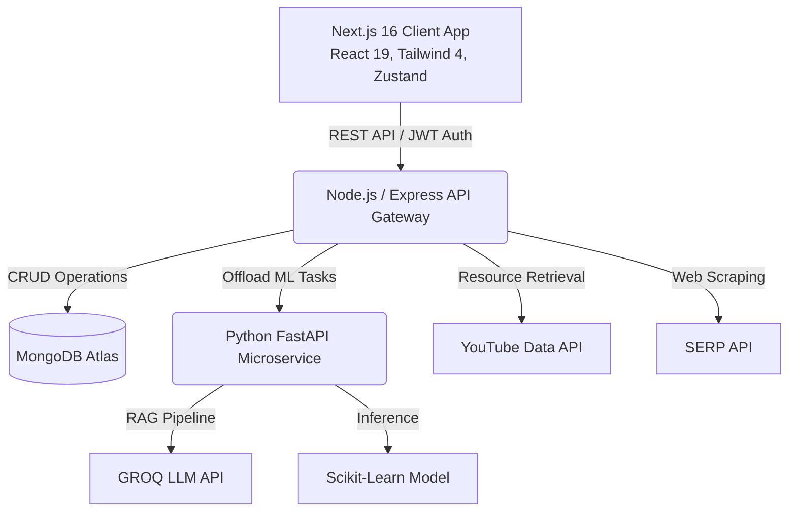

<div align="center">
  
  
  # 🚀 PathPilot
  
  **An Enterprise-Grade, AI-Powered Academic Companion & Learning Optimizer**
  
  *Leveraging Retrieval-Augmented Generation (RAG), Predictive Behavioral Analytics, and Machine Learning to engineer personalized, highly-optimized learning trajectories.*

  [](https://nextjs.org/)
  [](https://react.dev/)
  [](https://www.typescriptlang.org/)
  [](https://tailwindcss.com/)
  [](https://www.python.org/)
  [](https://fastapi.tiangolo.com/)
  [](https://nodejs.org/)
  [](https://www.mongodb.com/)
</div>

<br />

## 🌟 Executive Summary

**PathPilot** is a next-generation EdTech platform designed to solve the complexity of self-directed learning. By integrating **Large Language Models (LLMs)**, **Retrieval-Augmented Generation (RAG) pipelines**, and **Predictive Behavioral Analytics**, PathPilot automatically generates comprehensive learning roadmaps, curates high-fidelity resources using Machine Learning ranking algorithms, and proactively detects academic burnout before it occurs. 

Built with a scalable, modern technology stack, it features a rich Next.js frontend, a robust Express/Node.js backend, and a dedicated Python FastAPI microservice handling the heavy AI/ML compute.

---

## 🚀 Core Innovations & Advanced Features

### 🧠 1. AI-Driven Roadmap Generation (Powered by LLMs & RAG)
Unlike static course syllabi, PathPilot utilizes **GROQ's ultra-fast LLM inference** combined with a custom **Retrieval-Augmented Generation (RAG)** architecture. 
- **Contextual Generation:** It understands the user's target subject, current proficiency, and available time to generate a bespoke, node-based learning graph.
- **Dynamic Resource Fetching:** As the roadmap is generated, the system dynamically queries the web, YouTube, and official documentation, grounding the AI's recommendations in real-time, high-quality data.

### 📈 2. ML-Powered Resource Ranking Engine
Not all tutorials are created equal. Our dedicated Python microservice runs a **Scikit-learn trained predictive model** that evaluates and ranks educational content.
- **Multi-Modal Data Ingestion:** Fetches data from YouTube Data API v3 and SERP APIs.
- **Quality Scoring:** Evaluates video duration, view-to-like ratios, channel authority, and article recency to surface only top-tier learning materials.

### 🛡️ 3. Predictive Behavioral Analytics & Burnout Detection
PathPilot goes beyond academic tracking by quantifying the user's holistic well-being.
- **Multivariate Data Tracking:** Logs sleep quality, study duration, exercise, mood, and stress levels on a 1-10 scale.
- **Anomaly Detection:** Uses pattern recognition on historical data to detect early indicators of burnout.
- **Proactive Intervention:** Generates automated alerts and dynamically suggests adjusting weekly target hours to maintain a sustainable cognitive load.

### 🎮 4. Gamified Progression & Neurological Motivation
Built to maintain high user engagement through proven psychological hooks.
- **Algorithmic Streak Tracking:** Encourages daily logins and micro-learning sessions.
- **Dynamic Badge System:** Awards achievements based on complex milestone criteria (e.g., consistency champions, course completions).
- **Interactive Visualizations:** Uses ReactFlow for roadmap graphs and Recharts for analytical trend visualization.

---

## 🏗️ System Architecture

PathPilot employs a modern, distributed **Microservices Architecture**, separating concerns across a high-performance frontend, an API gateway/backend, and a specialized AI inference engine.



---

## 💻 Technical Stack Deep Dive

### 🌐 Frontend (Client-Side)
- **Framework:** Next.js 16.1.1 (App Router, Server Components, Turbopack)
- **Library:** React 19.2.3 (Strict TypeScript 5.x)
- **Styling:** Tailwind CSS 4.0 + shadcn/ui + Framer Motion (for fluid, 60fps micro-interactions)
- **Data Visualization:** ReactFlow (Interactive Graphs) & Recharts (Analytics)
- **State Management & Data Fetching:** React Hooks, Context API

### ⚙️ Backend (API Gateway & Auth)
- **Runtime & Framework:** Node.js + Express.js 5.2.1
- **Database & ORM:** MongoDB 9.1.1 + Mongoose ODM (Complex Aggregation Pipelines)
- **Security & Auth:** JWT (JSON Web Tokens), bcryptjs (Password Hashing), CORS, Helmet
- **Integration:** Axios for external REST communication

### 🤖 AI/ML Microservice (Python)
- **Framework:** FastAPI + Uvicorn (High-performance asynchronous endpoints)
- **Machine Learning:** Scikit-learn, Pandas, NumPy (Resource ranking & burnout classification models)
- **LLM Integration:** GROQ API (Llama-3 / Mixtral models for near-instant inference)

---

## 📸 Platform Previews

<div align="center">
  <h3>Modern, Data-Rich Dashboard</h3>
  
  <p><em>Real-time analytics, AI insights, and behavioral tracking visualized.</em></p>
</div>

<br/>

<div align="center">
  <h3>Interactive Node-Based Roadmaps</h3>
  
  <p><em>AI-generated, fully navigable curriculum graphs with contextual resources.</em></p>
</div>

---

## ⚡ Getting Started (Local Deployment)

This project requires a multi-service setup. Follow these instructions to run the application locally.

### 📋 Prerequisites
- **Node.js** (v18+) & **npm** / **yarn**
- **Python** (v3.8+) & **pip**
- **MongoDB** (Local instance or Atlas Cluster)
- API Keys: [GROQ](https://console.groq.com), [YouTube Data API](https://console.cloud.google.com/), [SERP API](https://serpapi.com/)

### 🛠️ Step-by-Step Installation

1. **Clone the repository:**
   ```bash
   git clone https://github.com/Akshayguleria22/PathPilot.git
   cd PathPilot
   ```

2. **Setup the Node.js Backend:**
   ```bash
   cd server
   npm install
   # Create a .env file based on .env.example
   # Add MONGO_URI, JWT_SECRET, YOUTUBE_API_KEY, SERP_API_KEY
   npm run dev
   ```

3. **Setup the Python AI Microservice:**
   ```bash
   cd ../ai
   pip install -r requirements.txt
   # Create a .env file and add GROQ_API_KEY
   uvicorn main:app --reload --port 8000
   ```

4. **Setup the Next.js Frontend:**
   ```bash
   cd ../client
   npm install
   # Create a .env.local file and add NEXT_PUBLIC_API_URL=http://localhost:5000
   npm run dev
   ```

5. **Access the Platform:**
   Open [http://localhost:3000](http://localhost:3000) in your browser.

---

## 📡 API Documentation & Endpoints

PathPilot provides a comprehensive RESTful API. Here are a few critical endpoints:

| Method | Endpoint | Description | Auth Required |
|--------|----------|-------------|---------------|
| `POST` | `/api/users/login` | Authenticate and retrieve JWT | ❌ |
| `GET`  | `/api/courses` | Retrieve all user courses & progress | ✅ |
| `POST` | `/api/roadmaps/generate` | Trigger LLM to generate a course roadmap | ✅ |
| `GET`  | `/api/resources/fetch` | RAG-based fetch for YT videos & Articles | ✅ |
| `POST` | `/api/habits/log` | Ingest daily behavioral & habit data | ✅ |
| `GET`  | `/api/analytics/weekly` | Aggregate stats & run burnout detection | ✅ |

*(For full API documentation including request/response schemas, refer to the `server/docs` or Postman collection).*

---

## 🛡️ Security & Performance Considerations
- **Security:** Complete route protection via Next.js middleware and Express JWT verification. Passwords securely hashed with `bcrypt`. 
- **Performance:** Implemented Turbopack for lightning-fast frontend compilation. Heavy compute tasks (ML inference) are strictly isolated to the Python microservice to prevent blocking the Node.js Event Loop.
- **Scalability:** Stateless JWT architecture and MongoDB decoupling allow the application to be easily containerized (Docker) and scaled horizontally across cloud providers (AWS/GCP).

---

## 👨‍💻 About The Developer

This project represents my capability to architect and deliver **full-stack, production-ready, AI-integrated software**. By combining modern frontend ecosystems (Next.js/React) with robust backend engineering and cutting-edge Machine Learning / LLM technologies, PathPilot demonstrates a deep understanding of today's tech landscape.

<div align="center">
  <b>Built with ❤️ by <a href="https://github.com/Akshayguleria22">Akshay Guleria</a></b>
</div>
